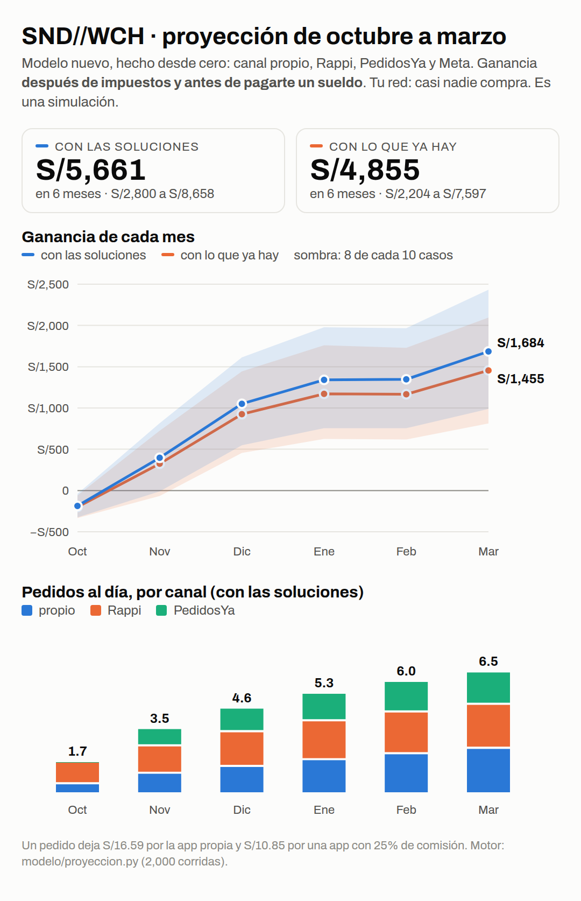

# Proyección de octubre 2026 a marzo 2027

**2026-10-09.** Dueño: «Agrega Rappi y PedidosYa, pero mejor no te bases en modelos viejos: hazlo
bien el modelo». Motor nuevo, hecho desde cero: `modelo/proyeccion.py` (2,000 corridas, día por día).
Reemplaza a la simulación del mismo día, que tenía los errores de abajo.

> **Es una simulación.** No hay un solo pedido real. Cada número de entrada tiene su rango en
> `SUPUESTOS` del script; se corrige con lo que se mida la primera semana.

## Mes a mes: con lo que ya hay

Lo que te queda **después de impuestos y antes de pagarte un sueldo**. Octubre son 11 días.

| mes | pedidos al día (propio / Rappi / PedidosYa) | ventas | ganancia (8 de cada 10 casos) | con las soluciones 3, 4 y 5 |
|---|---|---|---|---|
| oct | 1.7 (0.5 / 1.2 / 0.0) | S/491 | −S/200 (−S/333 a −S/60) | −S/187 |
| nov | 3.4 (1.0 / 1.5 / 0.9) | S/2,243 | S/324 (−S/67 a S/725) | S/396 |
| dic | 4.3 (1.2 / 1.8 / 1.3) | S/3,087 | S/925 (S/455 a S/1,444) | S/1,050 |
| ene | 5.0 (1.5 / 2.1 / 1.5) | S/3,588 | S/1,170 (S/624 a S/1,761) | S/1,340 |
| feb | 5.6 (1.7 / 2.2 / 1.6) | S/3,532 | S/1,165 (S/618 a S/1,729) | S/1,347 |
| mar | 6.0 (1.9 / 2.3 / 1.7) | S/4,115 | S/1,455 (S/812 a S/2,095) | S/1,684 |
| **6 meses** | | | **S/4,855** (S/2,204 a S/7,597) | **S/5,661** |

En el caso malo, la caja baja hasta −S/386: hace falta un colchón de unos S/400 para
octubre y noviembre.

## Un pedido

- **Ticket:** S/26.18. Los insumos y el empaque cuestan S/8.29.
- **Pedido propio:** deja S/16.59. Ya descuenta la tarjeta, los puntos y S/0.50 de gas y frío.
- **Pedido por app:** deja S/17.39 menos la comisión. Con 25% quedan S/10.85.
- **Para cubrir los costos fijos** hacen falta 1.2 pedidos propios al día, o
  1.9 por app.

## Qué decide el resultado

La correlación de cada supuesto con la ganancia de los 6 meses:

| supuesto | peso |
|---|---|
| rappi_dia | +0.71 |
| pya_dia | +0.43 |
| instagram_dia | +0.29 |
| brecha | -0.27 |
| google_dia | +0.21 |
| p2 | +0.18 |

**Lo que más pesa es cuánta gente llega por Rappi y PedidosYa.** El canal propio arranca chico, con
una cuenta y una ficha nuevas. Los primeros meses, el negocio vive de las apps, y el QR de la bolsa
es lo que va pasando a esos clientes al canal propio, donde dejan S/6 más por pedido.

**Meta:** un cliente cuesta ~S/93 (mediana) con una cuenta nueva y los datos de la
industria. Los S/350 sirven para medir ese costo, no para vender.

## Los errores que tenía la simulación anterior, y cómo quedaron

| error | antes | ahora |
|---|---|---|
| Tu red | 300 avisados y 90 que piden | ~30 avisados, 0–10% pide (dueño: «probablemente ninguno») |
| Canal propio | 1 a 3 clientes nuevos al día | Google 0.1–0.4 y, desde el 27 de octubre, Instagram 0–0.4 |
| Rappi y PedidosYa | no existían | Rappi desde la apertura, al 0% el primer mes; PedidosYa desde el 3 de noviembre |
| Gasto por pedido (S/0.50) | no se descontaba | se descuenta |
| Recompras | todo cliente «llegaba el día 1 del mes»: en octubre contaba recompras imposibles | el día de llegada es el real, y la recompra cae X días después |
| Impuestos | no había | Nuevo RUS (S/20–50) hasta S/8,000 al mes; arriba, IGV y renta del Régimen MYPE |
| Modelo base | heredado de modelo_v14 | escrito desde cero; solo usa los precios de `insumos.py` |

## Las soluciones (3, 4 y 5): lo que suman

Cada una sola, sobre «lo que ya hay», en 6 meses (mediana):

- **referidos**: +S/263
- **recompra**: +S/197
- **ticket**: +S/270

Suman poco **porque el volumen es chico**: mejoran cada pedido, no traen gente. El que trae gente
es el canal de las apps.

## Lo que hay que medir la primera semana (y volver a correr esto)
1. Pedidos por día en Rappi y, desde el alta, en PedidosYa. Es el supuesto que más pesa.
2. Las comisiones reales de tus contratos.
3. Cuántos pedidos llegan con `?src=` de Google y de Instagram.
4. Cuántos clientes de la app vuelven en 14 días.

## Actualización (2026-10-09, tarde): supuestos conservadores y cuánta pauta

Dueño: «Sé realista». Rappi pasa a 0.15–1 cliente nuevo al día y PedidosYa a 0.1–0.6, desde el
17 de noviembre. Resultado: **~S/1,700 en 6 meses con lo que ya hay** (S/156 a S/3,415) y ~S/2,400
con las soluciones; marzo, ~S/730–940 al mes, antes de tu sueldo.

Pauta mensual desde diciembre, sobre el plan con soluciones (800 corridas):

| pauta al mes | ganancia de 6 meses | gana más que sin pauta |
|---|---|---|
| 0 (solo la prueba de S/350) | S/2,411 | — |
| S/300 | S/1,767 | 11% de los casos |
| S/600 | S/1,123 | 10% |
| S/1,000 | S/154 | 8% |
| S/1,500 | −S/1,270 | 7% |
| S/2,500 | −S/4,286 | 3% |
| cualquiera, **solo si la prueba mide un cliente a ≤ S/30** | igual o mejor | nunca pierde |

Con los datos de la industria, un cliente por Meta cuesta S/39–159 (mediana S/100), y un cliente
deja ~S/35 en su vida. **La pauta solo conviene si la prueba de noviembre mide un costo de S/30 o
menos** (pasa en ~6% de los casos con datos de industria, más si las piezas y la app convierten
mejor). Si la prueba mide más, no se escala.

## Solución 4, hecha
La losa (06A) ya tenía el renglón «Avísame cuando salga →» solo para quien tenía cuenta. Ahora
aparece también a quien pidió sin cuenta, y la suscripción queda con el teléfono de su pedido
(`push-subscribe-pedido`). El aviso del día 7 al 10 considera también a esas personas. La solución 5
(ofrecer la bebida) ya existía: la pantalla de bebidas con «Sigo sin bebida».

## Corrección (2026-10-09, noche): el precio de Meta en Perú
El rango de S/5–45 por mil vistas usaba una fuente de «mercados emergentes». Las fuentes peruanas
de 2026 dicen S/5–12 para restaurantes y un promedio país de US$2.1–3.7. Ahora el modelo usa
S/5–14: **un cliente cuesta ~S/36 (S/23–52)**, y S/300–600 al mes ganan en la mitad de los casos.
Detalle y plan: `docs/marketing/PAUTA_BARATA.md`.

## Cómo traer más clientes: cada palanca simulada (2026-10-09, noche)
Dueño: «¿Lo de Google y las reseñas es una suposición en Perú? No conozco a nadie que se guíe en
eso… Antes, haz la simulación con números actuales: cómo mejorar, cómo que entren más clientes».
No hay un estudio peruano de restaurantes. Google dice que el 69% de los peruanos lee reseñas para
elegir negocio, pero en general; para comida mandan Instagram y TikTok. Google baja a 0.02–0.15
clientes/día. Con eso, HOY = **S/1,007 en 6 meses**, marzo S/514/mes, 3.1 pedidos/día.

| palanca (sola, sobre HOY) | 6 meses | marzo, al mes |
|---|---|---|
| Oficinas: visitas con muestras y pedido en grupo (+0.5 clientes/día, supuesto) | +S/2,041 | +S/524 |
| TikTok con los mismos videos de Instagram (+0.2/día) | +S/1,071 | +S/279 |
| Pauta S/600/mes si la prueba sale ≤ S/30, con radio corto, Reels y retargeting | +S/692 | +S/263 |
| Rappi trabajado: fotos, promos, calificaciones (+30%) | +S/545 | +S/115 |
| Oferta de 1.er pedido en los anuncios (bebida) | +S/300 | +S/145 |
| Referidos con botón de WhatsApp | +S/206 | +S/62 |
| Recompra: avisos sin cuenta (hecho) | +S/166 | +S/46 |
| PedidosYa desde el 3-nov en vez del 17 | +S/127 | +S/5 |
| Adelantar la prueba de Meta al 20-oct | ≈ S/0 | ≈ S/0 |

**Todo junto: S/6,986 en 6 meses (S/4,686 a S/10,016), marzo S/2,169 al mes y 8.5 pedidos al día.**
Adelantar la prueba no cambia la plata (la pauta queda casi pareja); lo que da es saber dos semanas
antes si conviene, a cambio de perder la medición de cuánta gente llega sola.

## Actualización (2026-10-09, cierre): empaque real y apps +10%
Dueño: «1. Sí [apps +10%] 2. Cotizados en total salen 2.50 soles [empaque] 3. Siii [anuncio de oficinas]».
- **Empaque real S/2.50 por pedido** (`insumos.EMPAQUE_PEDIDO`; antes se costeaba S/1.30). Un pedido
  propio deja ahora **S/15.39** (antes S/16.59).
- **Rappi y PedidosYa al +10%** (`SOBREPRECIO_APPS`): ticket por app S/28.80; al 25% de comisión
  deja S/11.61. Equilibrio: 1.3 pedidos propios al día, o 1.8 por app.
- Los dos efectos casi se anulan: **HOY = S/1,018 en 6 meses** (antes S/1,007), marzo S/510 al
  mes. **Todo junto = S/6,541** (S/4,342 a S/9,222), marzo S/1,981 al mes, 8.5 pedidos al día.
- Pendiente: `modelo/rentabilidad_por_parte.py` y `modelo_v14.py` siguen con el techo de S/1.30.

| palanca (sola, sobre HOY) | 6 meses | marzo, al mes |
|---|---|---|
| Oficinas (+0.5 clientes/día, supuesto) | +S/1,889 | +S/482 |
| TikTok con los mismos videos | +S/969 | +S/256 |
| Rappi trabajado (+30%) | +S/576 | +S/128 |
| Pauta S/600/mes con tácticas, si la prueba sale ≤ S/30 | +S/523 | +S/225 |
| Referidos con botón de WhatsApp | +S/194 | +S/60 |
| Oferta de 1.er pedido en anuncios (bebida) | +S/181 | +S/130 |
| Recompra: avisos sin cuenta (hecho) | +S/139 | +S/41 |
| PedidosYa desde el 3-nov | +S/118 | +S/6 |

### Precios para Rappi y PedidosYa (+10%, redondeado a .90)
Los pone el dueño en el portal de cada app (no hay acceso desde aquí). El menú secreto no va a las apps.

| producto | 15CM | 30CM |
|---|---|---|
| Philly Cheesesteak | S/25.90 | S/37.90 |
| Meatball Marinara | S/24.90 | S/36.90 |
| Turkey | S/26.90 | S/38.90 |
| Tuna Melt | S/25.90 | S/37.90 |
| Italian Hoagie | S/26.90 | S/38.90 |
| Classic Tuna | S/23.90 | S/35.90 |
| Bebidas: The Bloom / The Midnight / The Cool | S/6.90 / S/5.90 / S/6.90 | |
