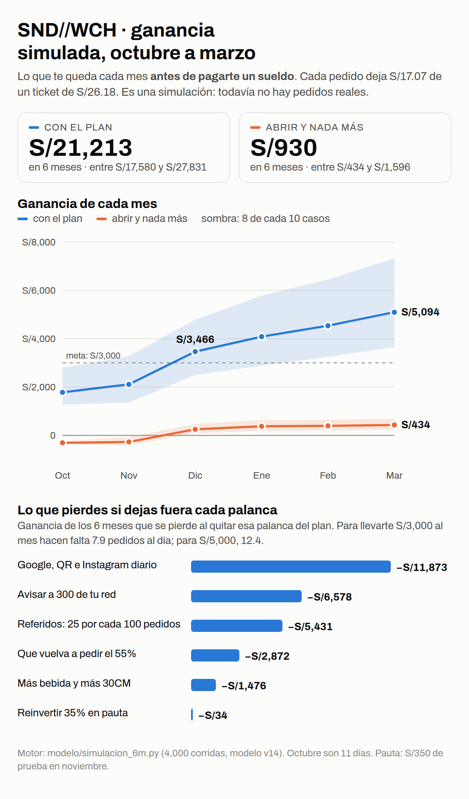

# Simulación de ganancias: octubre 2026 a marzo 2027

**2026-10-09.** Dueño: «Hazme una simulación de ganancias, analiza qué nos frena, cómo atacar eso y
mejorarlo en cada aspecto. Proyección de ganancia en los próximos 6 meses, cada mes, por qué y cómo
corregirlo».

> **Es una simulación, no un pronóstico.** No hay un solo pedido real. Motor:
> `modelo/simulacion_6m.py` (4,000 corridas sobre `modelo_v14`). Se vuelve a correr con
> `python3 modelo/simulacion_6m.py` y, cuando haya pedidos, se reemplazan los supuestos por lo medido.

## Lo que deja un pedido, con la carta de hoy

| | cobra | deja |
|---|---|---|
| un Signature (80% 15CM, 20% 30CM) | S/24.93 | S/17.16 |
| un Arma el tuyo | S/25.10 | S/16.99 |
| **un pedido** (1 sándwich, bebida en 1 de cada 4, 30% con tarjeta, recompensas 1.4%) | **S/26.18** | **S/17.07** |

`modelo_v14` usaba S/13.63, calculado con la carta de septiembre, que ya no existe. **El margen no es
el problema**: cada pedido deja el 65% de lo que cobra. Con S/500 de costos fijos:

| para llevarte al mes | pedidos por día |
|---|---|
| S/0 (cubrir costos) | 1.1 |
| S/1,500 | 4.5 |
| S/3,000 | 7.9 |
| S/5,000 | 12.4 |

La cocina aguanta 40 pedidos por día por persona. Ni el mejor escenario pasa de 14: **la
capacidad tampoco es el freno.**

## Mes a mes (mediana; entre paréntesis, 8 de cada 10 casos)

Lo que te queda **antes de pagarte un sueldo**. Octubre son 11 días.

| mes | abrir y nada más | con el plan completo | pedidos/día con el plan |
|---|---|---|---|
| oct | −S/307 | S/1,784 (S/1,267 a S/2,799) | 11.5, casi todo por tu red |
| nov | −S/272 | S/2,112 (S/1,359 a S/3,275) | 7.2: la red ya pidió; incluye la prueba de S/350 |
| dic | S/251 | S/3,466 (S/2,498 a S/4,790) | 9.0 |
| ene | S/380 | S/4,082 (S/2,886 a S/5,774) | 10.7 |
| feb | S/394 | S/4,538 (S/3,246 a S/6,449) | 13.4 |
| mar | S/434 | S/5,094 (S/3,652 a S/7,327) | 13.7 |
| **6 meses** | **S/930** | **S/21,213** (S/17,580 a S/27,831) | |

**Si te pagas S/1,500 al mes**, réstalos: con el plan, diciembre deja S/1,966 y marzo S/3,594. Sin el
plan, todos los meses salen en negativo.

**Caja:** abriendo sin más, en el caso malo la caja baja a −S/730: hace falta un colchón de ~S/750
para los dos primeros meses. Con el plan, la caja nunca baja de cero.

**Noviembre baja después de octubre, y es esperado:** el pico de octubre es tu red pidiendo de una
vez. Desde diciembre, lo que sube es lo que se repite: el orgánico, los referidos y la recompra.

## Qué nos frena, en orden, y cómo atacarlo

El freno es uno solo: **pocos clientes nuevos**. Abriendo sin más, el modelo se queda en ~2 pedidos
por día. Cada palanca del plan ataca eso desde un lado. El orden es por **lo que pierdes si la
quitas del plan**: las palancas se multiplican entre sí, así que medida sola sobre un negocio chico
cada una parece menor de lo que vale.

| # | palanca | si falta, pierdes | estado hoy | cómo se ataca |
|---|---|---|---|---|
| 1 | **3 clientes nuevos por día sin pauta**: Google Business, QR en la bolsa e Instagram diario | −S/11,873 | **Trabado**: Instagram no publica solo (Meta no vincula), el Estudio de Flow nunca corrió, Google sin verificar, bolsa sin aprobar (P34) | Reintentar el vínculo en Meta. Instalar el Estudio con la línea de `estudio/INSTALAR.md`. Verificar Google Business (`docs/marketing/google-business.md`). Aprobar y pedir la bolsa con QR. Mientras tanto, publicar a mano las 9 del perfil. |
| 2 | **Avisar a 300 de tu red**, con el link de «Avísale a tu gente» (`?src=lanzamiento`) | −S/6,578 | Listo en el panel | Mandarlo la semana del 20. Se supone que pide 1 de cada 3 (PREDICCION_V14 suponía todos). Sin ese link, se cuentan como gente que llegó sola y se ensucia la medición. |
| 3 | **Referidos: 25 por cada 100 pedidos** (el modelo suponía 6) | −S/5,431 | El mecanismo existe y paga lo que promete | Pedirlo en el momento bueno: la bolsa, el mensaje de «llegó tu pedido» y una historia por semana. Medirlo en el panel cada lunes. |
| 4 | **Que vuelva a pedir el 55%** (la industria dice 45%) | −S/2,872 | Existen la campaña de regreso y las recompensas | El primer pedido decide: a tiempo y caliente. Recordatorio a los 5–7 días. Medir cada semana cuántos hacen un segundo pedido. |
| 5 | **Ticket**: bebida en 4 de cada 10 pedidos (hoy 1 de 4) y 30CM en 3 de 10 (hoy 2) | −S/1,476 | El combo existe | Ofrecer la bebida en el carrito y mostrar cuánto más trae el 30CM. **Cambiar precios u ofertas lo decides tú.** |
| 6 | **Reinvertir 35% en pauta** | −S/34 | Aprobados S/350 de prueba | Ver abajo: hoy la pauta no mueve los 6 meses. |

## La pauta: los S/350 son para medir, no para vender

Con los datos de industria, un cliente por Meta cuesta, el mes de la prueba (cuenta nueva, «en frío»):

| si Meta cobra como | un cliente cuesta | S/350 compran | sale a cuenta (≤ S/31) |
|---|---|---|---|
| agencia peruana (CPM S/5–12) | S/35 (S/23 a S/50) | ~8 clientes | 35% de los casos |
| mercados emergentes (CPM S/11–45) | S/117 (S/60 a S/181) | ~2 clientes | nunca |

Un cliente deja **S/31 en toda su vida** (2.41 pedidos × S/17.07 × 0.75 de confianza). Por eso:

- **Los S/350 sirven para saber cuánto cuesta de verdad un cliente en Trujillo.** Ese número
  decide todo lo demás.
- **Se reinvierte solo si el costo medido queda por debajo de S/31.** Si Meta resulta barato, el
  plan sube a S/22,095 en 6 meses y marzo a S/5,889.
- **La prueba pasa al lunes 3 de noviembre**, para mantener los 14 días sin pauta desde la apertura:
  esa es la única forma de medir cuánta gente llega sola (NEGOCIO.md).
- **Cómo bajar el costo:**
  - Que la app convierta más: es la única de las tres variables que controlamos.
  - Piezas nuevas de Flow en vez de las mismas imágenes.
  - Anunciar con @snd__wch como identidad, lo que también está trabado por Meta.
  - Un radio que no pase de la zona de reparto.

## Lo que esta simulación no sabe

- **Ninguna palanca está medida.** El orgánico (1 o 3 por día), la red (30% pide), los referidos y
  la recompra son supuestos. Los primeros 14 días miden el orgánico; el primer mes, la red y los
  referidos.
- **El precio de Meta en Trujillo** va de 1 a 9 entre las dos fuentes. Lo mide la prueba de noviembre.
- **Un sándwich por pedido** es conservador: si un pedido trae 1.3, todo sube.
- **El mes a mes tiene ruido** (±18%). Por eso cada mes va con su rango, no solo con la mediana.
