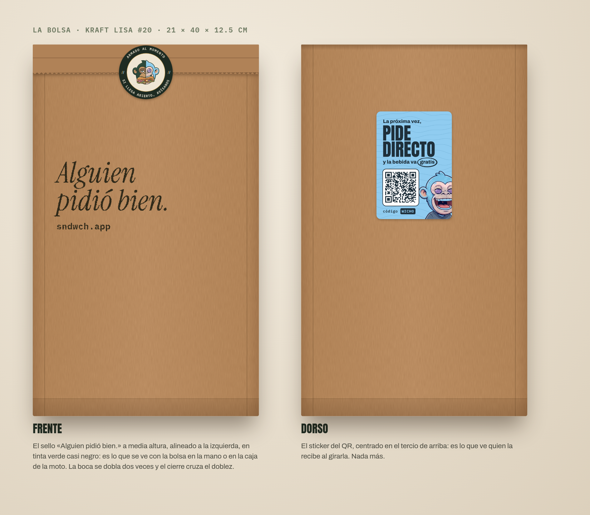
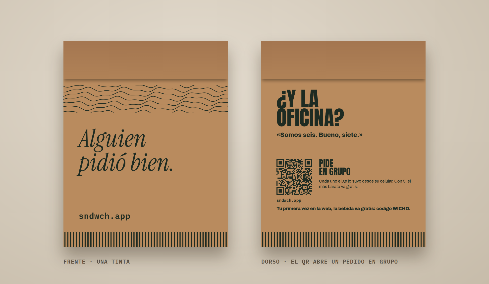
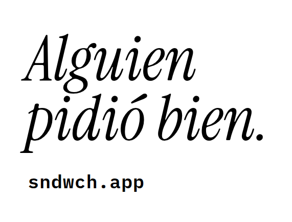

# La bolsa (propuesta 2026-10-09): kraft lisa + sello + dos stickers

Dueño: «C, modificar el empaque», «compre bolsas lisas y luego con sello le coloco el frontal.
Invertiría solo en sellos y tinta», «el QR no debe ir en el sticker de cierre» y «reestructura la
bolsa bien». **Es una propuesta**: nada se compra ni se imprime sin tu OK.

**Cada cara hace un solo trabajo.** El frente es el letrero que ve todo el que se cruza con la
bolsa (el sello) y lleva el cierre. El dorso le habla a quien la recibe (el sticker del QR). Así
nada compite: antes estaba todo apilado en la misma cara.

## Las piezas

| pieza | medida | dónde va | archivo | costo por pedido |
|---|---|---|---|---|
| **Bolsa** kraft lisa #20, 60 g | 21 × 40 × 12.5 cm | — | — | ~S/0.26 (S/220 el millar + IGV, offi.pe) |
| **Sello** «Alguien pidió bien.» | 12 × 9 cm | frente, a media altura, a 2.2 cm del borde izquierdo | `opcion-barata/sello-frente.pdf` | ~S/0.01 de tinta (el sello se compra una vez) |
| **Sticker de cierre** | Ø 50 mm | cruzando el doblez de la boca, al centro | `../stickers/1-cierre.pdf` | por cotizar |
| **Sticker del QR** | 70 × 100 mm | dorso, centrado, a 6 cm del doblez | `../stickers/2-qr-bolsa.pdf` | por cotizar |
| Papel manteca | — | adentro, en cada sándwich | (el que ya tienes) | S/0.075 |

Total estimado: **~S/0.65 por pedido** (contra S/3.90 de la bolsa impresa a 100 unidades).

## Cómo se arma (para que despachar no tarde más)
1. **En tanda, antes del servicio:** se sellan 50 bolsas y se les pega el sticker del QR atrás.
   Son unos minutos y se hace con las manos limpias, lejos de la plancha.
2. **Al despachar:** pedido adentro, la boca se dobla **dos veces** hacia el frente y el sticker de
   cierre cruza el doblez, al centro. Nada más.
3. Tinta del sello: para papel y kraft, base agua, en **verde casi negro** (`#1E2B22`) o negro.
   Se deja secar un minuto antes de apilar.

El QR del sticker lleva `sndwch.app/?src=bolsa&codigo=WICHO`: abre la web con el código WICHO ya
puesto (la bebida más barata gratis, una vez por celular). Se verificó con un lector.

Se regenera con `node scripts/piezas/stickers.mjs` (los stickers y esta maqueta) y
`node scripts/piezas/bolsa.mjs <datos.json> docs/marketing/bolsa` (el sello).

---

## Antes: la bolsa impresa a una tinta (2026-10-08) — descartada por costo
Impresa salía S/3.90 la bolsa a 100 unidades (cotización del dueño). Queda el diseño por si algún
día el volumen la abarata.

Dueño: «Diseña toda la bolsa». Y después: «Papel manteca ya tengo, está con el logo como cara;
a futuro podríamos cambiarlo. No puedo mandar tarjetas por cada uno por ahora: **debe ser todo
en la bolsa, a una sola tinta**. En Rappi también se puede armar el tuyo. La etiqueta no: añade
trabajo». **Es una propuesta**: nada se imprime sin tu OK.

## Lo que lleva cada pedido

| pieza | qué hace | archivo |
|---|---|---|
| **Papel manteca** | el que ya tienes, con la cara de los hermanos | — |
| **Bolsa, frente** | le habla a quien la ve pasar: en la oficina, en el ascensor, en la mesa de al lado. «Alguien pidió bien.» y dónde se pide | `bolsa-frente.pdf` |
| **Bolsa, dorso** | hace el trabajo de la tarjeta: quien la recibe en el trabajo puede organizar el próximo pedido. «¿Y la oficina?» y un QR que abre un pedido en grupo | `bolsa-dorso.pdf` |

Nada se agrega a mano: ni tarjeta, ni sticker, ni etiqueta. La bolsa va igual en los pedidos
propios y en los de Rappi, así que no dice nada que en Rappi no sea cierto.

## Por qué está cada palabra

- **«Alguien pidió bien.»** Halaga a quien pidió y le da curiosidad a quien mira. No dice
  «pide», pero el siguiente renglón dice dónde.
- **sndwch.app en vez de SND//WCH.** El `//` es dorado y celeste, o no va (`CLAUDE.md`,
  regla 10), y a una tinta no se puede. sndwch.app es el nombre y además es donde se pide.
- **«¿Y la oficina? / Somos seis. Bueno, siete.»** Lo dice WICHO, que exagera y cuenta mal. El
  dorso da la regla real: «Con 5, el más barato va gratis» (sale de `REGLAS.organizadorDesde`;
  si cambia, se regenera).
- **El QR** lleva `https://sndwch.app/?grupo=1&src=bolsa&codigo=WICHO`: abre un pedido en grupo
  nuevo, el análisis sabe cuántos pedidos trae la bolsa, y el checkout ofrece ya escrito el código.
- **«Tu primera vez en la web, la bebida va gratis: código WICHO.»** (2026-10-09, dueño: «Si aprueba
  todo»). Es la razón para que quien pidió por Rappi o PedidosYa pida directo la próxima vez:
  allí cada pedido deja S/3.78 más. El código vale una vez por celular y regala la bebida más
  barata del carrito (tipo «bebida», migración 20261009025200).
- **Las ondas y las costillas** son las texturas de WICHO y de SANDO. A una tinta funcionan igual.

## Para la imprenta

| | |
|---|---|
| **Impresión** | **una tinta**: `#1E2B22` (verde casi negro). Si el negro le sale más barato a la imprenta, el diseño funciona igual en negro |
| **Caras** | frente y dorso (dos pantallas, la misma tinta). Si solo puedes una cara, **imprime el dorso**: es el que trae pedidos |
| **Medida** | el arte es para una cara de 24 × 30 cm (PDF con 3 mm de sangrado: 24.6 × 30.6 cm). **Los 6 cm de arriba quedan bajo el doblez**, así que ahí no va nada. Si tu bolsa mide otra cosa, se regenera a su medida |
| **QR** | 5.2 cm. **Antes del tiraje, escanea la prueba impresa** con dos celulares distintos: el kraft da menos contraste que el papel blanco |
| **Cómo** | serigrafía sobre la bolsa kraft que ya cotizaste (S/0.35, `docs/NEGOCIO.md`). Pregunta el mínimo y el plazo: si no llega para el 20, sale con bolsa lisa y la impresa entra después |

## Más adelante (diseñado, no se imprime ahora)

En `mas-adelante/`: las tarjetas (grupo y Rappi), la etiqueta del sándwich
y un papel manteca de patrón. Quedan listos para cuando quieras cambiar el papel o agregar algo.

Se regenera con `node scripts/piezas/bolsa.mjs <datos.json> docs/marketing/bolsa`.

## El arte del sello
En negro, a tamaño real 12 × 9 cm: `opcion-barata/sello-frente.pdf` (se lo mandas a la sellería
tal cual). **El QR no va en el sello**: en kraft la tinta se corre y deja de leerse.

