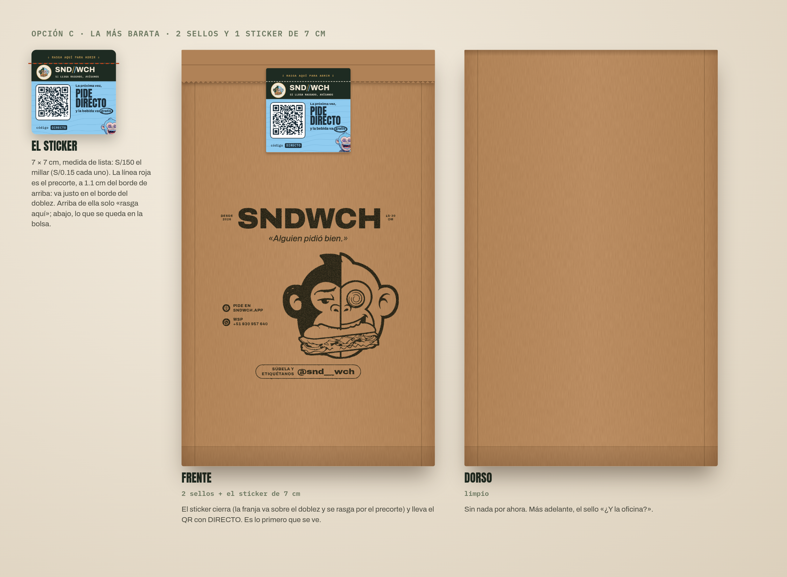
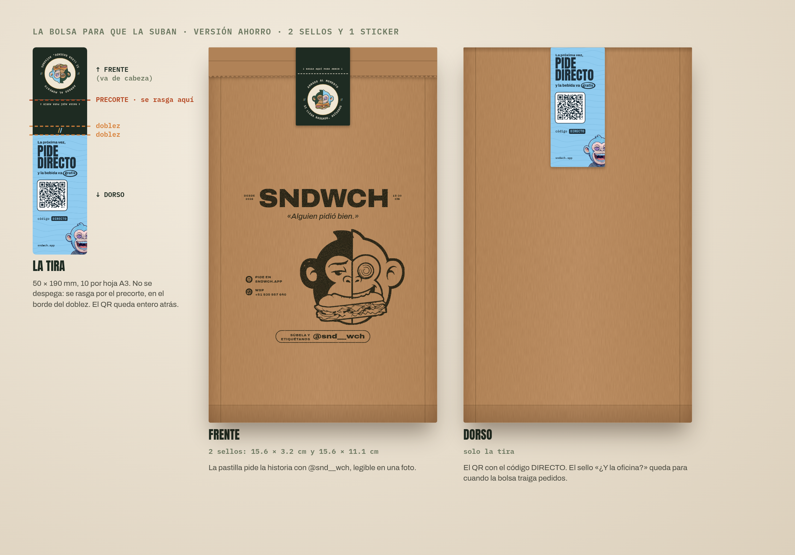
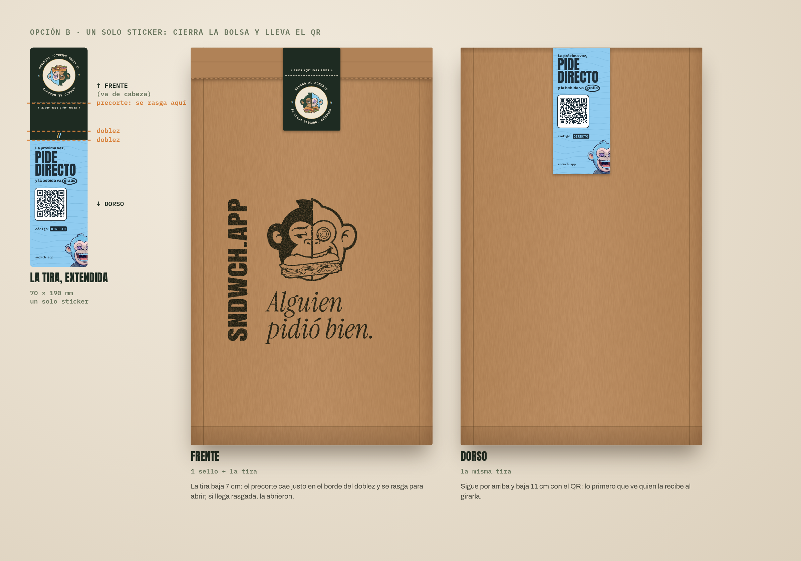
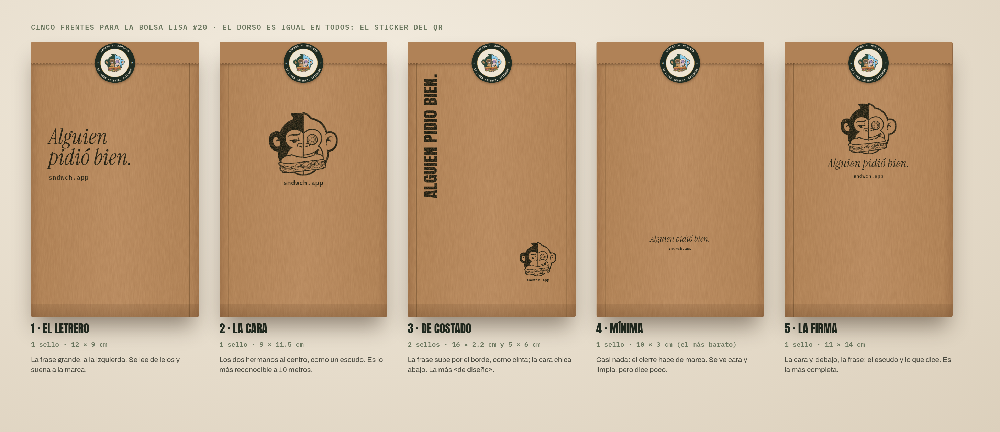

# La bolsa (propuesta 2026-10-09): kraft lisa + sello + dos stickers

Dueño: «C, modificar el empaque», «compre bolsas lisas y luego con sello le coloco el frontal.
Invertiría solo en sellos y tinta», «el QR no debe ir en el sticker de cierre» y «reestructura la
bolsa bien». **Es una propuesta**: nada se compra ni se imprime sin tu OK.

## El frente elegido: la mezcla de 1, 2 y 3 (2026-10-09)
Dueño: «Me gusta la idea del sello con el logo, me encantó. Mezcla 1, 2 y 3, estructúralo bonito y
muéstrame cómo quedaría atrás». **Un solo sello de 15 × 13 cm** (`sellos/6-mezcla-150x130.pdf`):
- **la cara de los hermanos** (de la 2) arriba y **«Alguien pidió bien.»** (de la 1) debajo, en
  una columna alineada a la izquierda;
- **sndwch.app como cinta vertical** (de la 3) al costado, del mismo alto que la columna, así todo
  cuadra en un bloque.
Va centrado a media altura. Al ser un solo sello no hay nada que alinear: se sella y listo.
**El dorso** lleva solo el sticker del QR, centrado a la misma altura que el sello del frente.

## Opción C, la más barata: un sticker de 7 cm de lista (2026-10-09)
Con la lista de precios de stickers que trajo el dueño (7 cm a S/150 el millar), un **cuadrado de
7 × 7 cm** (`../stickers/5-cierre-qr-70x70.pdf`) hace lo de la tira por la mitad o menos: va al
frente, arriba al centro; la franja de 1.1 cm («rasga aquí») va sobre la solapa y el precorte cae
justo en el borde del doblez; abajo, el logo y el QR con DIRECTO se quedan en la bolsa (2026-10-10:
antes el logo iba arriba y se iba con la solapa; corregido). El dorso queda limpio (el sello de la oficina, para más adelante).

| por bolsa | opción C |
|---|---|
| bolsa kraft lisa #20 | S/0.26 (S/220 el millar + IGV) |
| sticker 7 × 7 (1,000) | S/0.15 |
| papel manteca | S/0.075 |
| tinta del sello | ~S/0.01 |
| **total** | **~S/0.50** (contra S/2.50 del empaque impreso) |

Inversión inicial: 1,000 stickers S/150 + 1,000 bolsas ~S/260 + los dos sellos (por cotizar).

## La bolsa para que la suban, versión ahorro (2026-10-09)
Dueño: «basándote en marketing, en que la bolsa sea viral» → «cada sello cuesta dinero» →
«la idea para rasgar, genial; las frases, para el futuro mejor. Mejora más ahorrando precios».

- **Pide la historia:** la pastilla «Súbela y etiquétanos **@snd__wch**».
- **Un solo sticker que se rasga, no se despega:** la tira de 50 × 190 mm con precorte en el borde
  del doblez (detalle en `docs/marketing/stickers/`). El QR queda entero atrás.
- **Dos sellos** (`sellos/7-cabecera-156x32.pdf` y `sellos/7-pie-156x111.pdf`).

| | antes | ahora |
|---|---|---|
| sellos | 3 · ~408 cm² (18.6 × 4, 18.6 × 13.7, 17.2 × 4.6) | **2 · ~223 cm²** (15.6 × 3.2 y 15.6 × 11.1): −45% de área |
| tira | 70 × 215 mm · 4–5 por hoja A3 · 3 versiones | **50 × 190 mm · 10 por hoja A3 · 1 versión**: menos de la mitad por tira |

**Para más adelante**, cuando la bolsa demuestre que trae pedidos (`?src=bolsa`, canjes de DIRECTO,
menciones en historias): el sello del dorso «¿Y la oficina?» (`oficina()` en el script, con la
regla de `REGLAS.organizadorDesde`) y las frases que rotan impresas en la tira (`FRASES_TIRA`).

## El cartel (2026-10-09, sobre una referencia del dueño)
Dueño, con la foto de una bolsa kraft impresa a una tinta: «probemos un diseño parecido a este»,
«más parecido a este, por favor» y «el dibujo con líneas no me gusta, es más la distribución en la
bolsa». Se copia la **distribución** de la referencia con lo nuestro (el logo sólido se queda):

- **El nombre ancho y centrado:** SNDWCH en Archivo negra a todo lo ancho (eje de ancho al 125%),
  con dos etiquetas chicas pegadas a los costados: «Desde 2026» y «15·30 cm» (los dos tamaños). A
  una tinta el `//` no va (CLAUDE.md, regla 10).
- **La frase justo debajo**, en itálica de palo seco como la referencia: «Alguien pidió bien.»
- **La cara de los hermanos grande, abajo a la derecha** (13 cm), pegada a la frase.
- **Los datos abajo a la izquierda**, con íconos en círculo lleno y el dibujo calado: pide en
  sndwch.app · WSP +51 930 957 640 · síguenos en IG @snd__wch. Sin dirección (no hay local). El
  WhatsApp se lee de la app (`var WA` en `src/app/01-catalogo-y-estado.ts`).
- **Un solo sticker: la tira** arriba (sello redondo al frente, QR con DIRECTO al dorso). El
  bloque va centrado en lo que queda debajo.
- **Sellos:** los de «La bolsa para que la suban» (arriba): nombre, frase, pie, dorso y adentro.
  Si algún día se imprime la bolsa, el mismo arte sirve a una tinta.
- El logo a una tinta sale del avatar completo (`logo_a_sello.py`), con un contorno que cierra la
  cabeza: el de antes venía recortado de origen.

Para regenerar hace falta Archivo con su eje de ancho (`FUENTES_CSS` con las caras variables de
Archivo, o el respaldo de Google Fonts que ya las pide).

## Opción B: un solo sticker que cierra y lleva el QR (2026-10-09)
Dueño: «DIRECTO. Segundo, hagamos otra pero con el sticker que no sean dos sino uno solo, el de
cierre, largo, y contenga el QR. Algo así» (con un dibujo de una tira sobre la boca de la bolsa).

Una **tira de 50 × 190 mm** (`../stickers/4-tira-50x190.pdf`, con precorte) pasa por encima de la boca:
- **frente, 7.2 cm:** el precorte en el borde del doblez («rasga aquí para abrir») y el sello
  redondo;
- **arriba, 0.8 cm:** el `//` dorado y celeste, justo en el canto;
- **dorso, 11 cm:** el QR en el mundo de WICHO, con el código DIRECTO.
El sello de la mezcla baja un poco en el frente para dejarle aire a la tira. **Ventaja:** un solo
sticker, que se pone al despachar; nada que pegar en tanda. **Ojo:** la tira tiene que ir bien
centrada sobre la boca, o el QR queda torcido atrás.

## Cinco frentes para elegir (2026-10-09, dueño: «rediséñala bien, dame ejemplos»)
Lo único que cambia entre ellos es lo **sellado**; el cierre, el dorso con el QR y la bolsa son
los mismos. La maqueta de arriba es la mezcla elegida.

| | sellos (arte en `sellos/`, negro, a tamaño real) | lo bueno | lo flojo |
|---|---|---|---|
| **1 · El letrero** | `1-letrero-120x90.pdf` | la frase se lee de lejos y suena a la marca | sin cara, no se reconoce a los hermanos |
| **2 · La cara** | `2-cara-90x115.pdf` | lo más reconocible a 10 metros: los dos hermanos | no dice nada; depende de que ya los conozcan |
| **3 · De costado** | `3-costado-160x22.pdf` + `3-costado-logo-50x60.pdf` | la más «de diseño»; la frase como cinta | dos sellos y alinearlos cada vez |
| **4 · Mínima** | `4-minima-100x30.pdf` | la más barata y limpia | casi no se ve en la calle |
| **5 · La firma** | `5-firma-110x140.pdf` | la cara **y** la frase: escudo + lo que dice | el sello más grande (el más caro de los cinco) |

El logo a una tinta sale de `scripts/piezas/logo_a_sello.py` (umbral sobre el logo de los
hermanos: SANDO queda sólido y WICHO en línea, con su espiral).

**Cada cara hace un solo trabajo.** El frente es el letrero que ve todo el que se cruza con la
bolsa (el sello) y lleva el cierre. El dorso le habla a quien la recibe (el sticker del QR). Así
nada compite: antes estaba todo apilado en la misma cara.

## Las piezas

| pieza | medida | dónde va | archivo | costo por pedido |
|---|---|---|---|---|
| **Bolsa** kraft lisa #20, 60 g | 21 × 40 × 12.5 cm | — | — | ~S/0.26 (S/220 el millar + IGV, offi.pe) |
| **Sello** de la mezcla (cara + frase + cinta) | 15 × 13 cm | frente, centrado a media altura | `sellos/6-mezcla-150x130.pdf` | ~S/0.01 de tinta (el sello se compra una vez) |
| **Sticker de cierre** | Ø 50 mm | cruzando el doblez de la boca, al centro | `../stickers/1-cierre.pdf` | por cotizar |
| **Sticker del QR** | 70 × 100 mm | dorso, centrado, a 6 cm del doblez | `../stickers/2-qr-bolsa.pdf` | por cotizar |
| Papel manteca | — | adentro, en cada sándwich | (el que ya tienes) | S/0.075 |

Total estimado: **~S/0.65 por pedido** (contra S/3.90 de la bolsa impresa a 100 unidades).

## Cómo se arma (para que despachar no tarde más)
1. **En tanda, antes del servicio:** se sellan 50 bolsas y se les pega el sticker del QR atrás.
   Son unos minutos y se hace con las manos limpias, lejos de la plancha.
2. **Al despachar:** pedido adentro, la boca se dobla **dos veces** hacia el frente y el sticker de
   cierre cruza el doblez, al centro. Nada más.
3. Tinta del sello: para papel y kraft, base agua, en **verde casi negro** (`#1E2B22`) o negro.
   Se deja secar un minuto antes de apilar.

El QR del sticker lleva `sndwch.app/?src=bolsa&codigo=DIRECTO`: abre la web con el código DIRECTO ya
puesto (la bebida más barata gratis, una vez por celular). Se verificó con un lector.

Se regenera con `node scripts/piezas/stickers.mjs` (los stickers y esta maqueta) y
`node scripts/piezas/bolsa.mjs <datos.json> docs/marketing/bolsa` (el sello).

---

## Antes: la bolsa impresa a una tinta (2026-10-08) — descartada por costo
Impresa salía S/3.90 la bolsa a 100 unidades (cotización del dueño). Queda el diseño por si algún
día el volumen la abarata.

Dueño: «Diseña toda la bolsa». Y después: «Papel manteca ya tengo, está con el logo como cara;
a futuro podríamos cambiarlo. No puedo mandar tarjetas por cada uno por ahora: **debe ser todo
en la bolsa, a una sola tinta**. En Rappi también se puede armar el tuyo. La etiqueta no: añade
trabajo». **Es una propuesta**: nada se imprime sin tu OK.

## Lo que lleva cada pedido

| pieza | qué hace | archivo |
|---|---|---|
| **Papel manteca** | el que ya tienes, con la cara de los hermanos | — |
| **Bolsa, frente** | le habla a quien la ve pasar: en la oficina, en el ascensor, en la mesa de al lado. «Alguien pidió bien.» y dónde se pide | `bolsa-frente.pdf` |
| **Bolsa, dorso** | hace el trabajo de la tarjeta: quien la recibe en el trabajo puede organizar el próximo pedido. «¿Y la oficina?» y un QR que abre un pedido en grupo | `bolsa-dorso.pdf` |

Nada se agrega a mano: ni tarjeta, ni sticker, ni etiqueta. La bolsa va igual en los pedidos
propios y en los de Rappi, así que no dice nada que en Rappi no sea cierto.

## Por qué está cada palabra

- **«Alguien pidió bien.»** Halaga a quien pidió y le da curiosidad a quien mira. No dice
  «pide», pero el siguiente renglón dice dónde.
- **sndwch.app en vez de SND//WCH.** El `//` es dorado y celeste, o no va (`CLAUDE.md`,
  regla 10), y a una tinta no se puede. sndwch.app es el nombre y además es donde se pide.
- **«¿Y la oficina? / Somos seis. Bueno, siete.»** Lo dice WICHO, que exagera y cuenta mal. El
  dorso da la regla real: «Con 5, el más barato va gratis» (sale de `REGLAS.organizadorDesde`;
  si cambia, se regenera).
- **El QR** lleva `https://sndwch.app/?grupo=1&src=bolsa&codigo=DIRECTO`: abre un pedido en grupo
  nuevo, el análisis sabe cuántos pedidos trae la bolsa, y el checkout ofrece ya escrito el código.
- **«Tu primera vez en la web, la bebida va gratis: código DIRECTO.»** (2026-10-09, dueño: «Si aprueba
  todo»). Es la razón para que quien pidió por Rappi o PedidosYa pida directo la próxima vez:
  allí cada pedido deja S/3.78 más. El código vale una vez por celular y regala la bebida más
  barata del carrito (tipo «bebida», migración 20261009025200).
- **Las ondas y las costillas** son las texturas de WICHO y de SANDO. A una tinta funcionan igual.

## Para la imprenta

| | |
|---|---|
| **Impresión** | **una tinta**: `#1E2B22` (verde casi negro). Si el negro le sale más barato a la imprenta, el diseño funciona igual en negro |
| **Caras** | frente y dorso (dos pantallas, la misma tinta). Si solo puedes una cara, **imprime el dorso**: es el que trae pedidos |
| **Medida** | el arte es para una cara de 24 × 30 cm (PDF con 3 mm de sangrado: 24.6 × 30.6 cm). **Los 6 cm de arriba quedan bajo el doblez**, así que ahí no va nada. Si tu bolsa mide otra cosa, se regenera a su medida |
| **QR** | 5.2 cm. **Antes del tiraje, escanea la prueba impresa** con dos celulares distintos: el kraft da menos contraste que el papel blanco |
| **Cómo** | serigrafía sobre la bolsa kraft que ya cotizaste (S/0.35, `docs/NEGOCIO.md`). Pregunta el mínimo y el plazo: si no llega para el 20, sale con bolsa lisa y la impresa entra después |

## Más adelante (diseñado, no se imprime ahora)

En `mas-adelante/`: las tarjetas (grupo y Rappi), la etiqueta del sándwich
y un papel manteca de patrón. Quedan listos para cuando quieras cambiar el papel o agregar algo.

Se regenera con `node scripts/piezas/bolsa.mjs <datos.json> docs/marketing/bolsa`.

## El arte del sello
En negro, a tamaño real 12 × 9 cm: `opcion-barata/sello-frente.pdf` (se lo mandas a la sellería
tal cual). **El QR no va en el sello**: en kraft la tinta se corre y deja de leerse.

