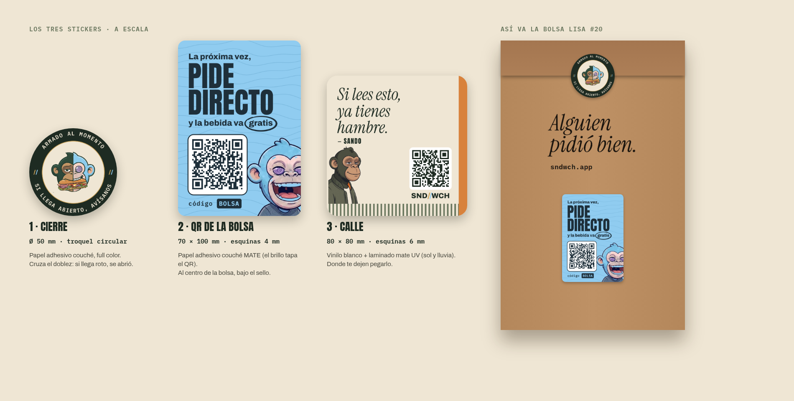

# Los tres stickers (propuesta 2026-10-09)

Dueño: «El QR no debe ir en el sticker de cierre sino un sticker de cierre y aparte el sticker del
QR, diséñalo bonito. Hazlo bien con tamaños de cada sticker. Hay tres stickers: el de sellado de
la bolsa, QR en la bolsa y un sticker interesante para poner en la calle como pequeña publicidad
extra». **Es una propuesta**: nada se imprime sin tu OK.

| | medida | material | va | QR |
|---|---|---|---|---|
| **1 · Cierre** `1-cierre.pdf` | **Ø 50 mm**, troquel circular | papel adhesivo couché, full color | cruzando el doblez de la bolsa: el que la abre lo rompe | — |
| **2 · QR de la bolsa** `2-qr-bolsa.pdf` | **70 × 100 mm**, esquinas de 4 mm | papel adhesivo couché **mate** (el brillo no deja leer el QR) | en el **dorso** de la bolsa, centrado (ver `docs/marketing/bolsa/`) | `sndwch.app/?src=bolsa&codigo=DIRECTO` |
| **3 · Calle** `3-calle.pdf` | **80 × 80 mm**, esquinas de 6 mm | **vinilo** blanco + laminado mate UV (aguanta sol y lluvia) | donde te dejen pegarlo (abajo) | `sndwch.app/?src=calle&codigo=DIRECTO` |

| **4 · Tira de cierre con QR** `4-tira-50x190.pdf` | **50 × 190 mm**, esquinas de 4 mm, con **precorte** | papel adhesivo couché **mate** | cruza la boca: 7.2 cm al frente (sello redondo Ø40), 0.8 cm arriba, 11 cm al dorso (QR) | `sndwch.app/?src=bolsa&codigo=DIRECTO` |

La **tira** reemplaza al cierre redondo y al sticker del QR: un solo sticker por bolsa (dueño:
«que no sean dos sino uno solo, el de cierre, largo, y contenga el QR»). En el pliego el tramo del
frente va **de cabeza**: al doblarla sobre la boca, las dos caras quedan derechas.

**Precorte** (dueño: «usualmente se jode al sacar el sticker» → «la idea para rasgar, genial»): la
tira no se despega, se **rasga** por una línea de micro-perforado a **2.4 cm del canto de arriba en
el tramo del frente** (en el pliego: a 4.8 cm del extremo del frente). Al pegarla, la línea va justo
en el borde del doblez. El kraft no se rompe, el QR queda entero atrás y un precorte roto delata si
la abrieron. **Pídele a la imprenta el micro-perforado en esa línea** (en el arte va solo la guía).

**Ahorro** (dueño: «mejora más ahorrando precios»): 50 mm de ancho en vez de 70. En una hoja A3
(297 × 420 mm) entran **10 tiras de 50 × 190** (5 × 2) contra 4 o 5 de 70 × 215: cada tira sale a
**menos de la mitad**. Una sola versión. Las frases que rotan quedan para más adelante
(`FRASES_TIRA` en el script; dueño: «las frases, para el futuro mejor»).

| **5 · Cierre con QR, cuadrado** `5-cierre-qr-70x70.pdf` (opción C, la más barata) | **7 × 7 cm**, esquinas de 4 mm, con **precorte** | papel adhesivo full color (medida de lista) | en el **dorso**, arriba al centro (la boca se dobla hacia atrás): la franja de 1.1 cm («rasga aquí») va sobre la solapa y el precorte cae justo en el borde del doblez; abajo, el logo y el QR se quedan en la bolsa | `sndwch.app/?src=bolsa&codigo=DIRECTO` |

### Precios de referencia (lista que trajo el dueño, 2026-10-09)
Stickers troquelados, impresión full color, papel adhesivo (Host4Plus / Supersiro SAC):

| medida | 250 | 500 | 1,000 |
|---|---|---|---|
| 3 cm | S/22 | S/30 | S/40 |
| 4 cm | S/30 | S/45 | S/79 |
| 5 cm | S/35 | S/50 | S/89 |
| 6 cm | S/45 | S/70 | S/105 |
| 7 cm | S/60 | S/90 | S/150 |
| 8 cm | S/70 | S/130 | S/190 |
| 9 cm | S/75 | S/145 | S/200 |

A 1,000 unidades el cm² sale a ~S/0.0025–0.003. Por bolsa: **opción C (7 × 7) S/0.15**; opción
A (redondo de 5 + QR de 7 × 10 a medida) ~S/0.29; la tira de 5 × 19 a medida ~S/0.25–0.29. Medidas
a medida y el precorte: consultarlos. El de la calle (8 cm) va en **vinilo** para exterior: esta
lista es de papel, pedir precio de vinilo aparte.

Todos los PDF llevan **3 mm de sangrado** por lado (el arte pasa del corte): la imprenta corta en
la medida de la tabla. Los dos QR se verificaron con un lector: abren su enlace.

## Por qué es así cada uno
- **Cierre.** Su trabajo es cerrar y dar confianza: el logo de los dos hermanos al centro y, en el
  anillo, «Armado al momento» arriba y «Si llega abierto, avísanos» abajo (los dos se leen
  derechos), con el `//` a cada lado. «Avísanos» es real: el pedido tiene su botón de «algo salió
  mal».
- **QR de la bolsa.** Es el mundo de WICHO, el de la energía de sticker: celeste, las curvas de
  nivel de su polo, él riéndose, y su círculo de plumón alrededor de «gratis». Le habla a quien
  pidió por Rappi o PedidosYa: «La próxima vez, pide directo y la bebida va gratis», con el
  código DIRECTO ya puesto en el QR (se llamó BOLSA y WICHO; dueño: «el código que sea algo más genérico» → «DIRECTO») (vale una vez por celular, la bebida más barata del carrito).
- **Calle.** Papel crema, tinta, el forro naranja vertical y el acanalado (la paleta de SANDO). Ordenado como un aviso que se lee al paso (dueño, 2026-10-10: «más marketing»):
  el gancho («Si lees esto, ya tienes hambre.»), qué es («Sándwiches a domicilio»), por qué ahora
  (un sello naranja: «bebida gratis en tu 1.er pedido», el código DIRECTO ya va puesto en el QR) y
  qué hacer («escanea y pide»). Sin SANDO: a quien no lo conoce no le dice nada; en su lugar va el
  logo (dueño, 2026-10-10: «cambia a sando por el logo»), el mismo que verá en la bolsa. El QR
  (`?src=calle`) cuenta los pedidos que trae la calle.

## Dónde pegar el de la calle
Pegarlo en postes, paredes o mobiliario público sin permiso suele estar prohibido por las
ordenanzas municipales de publicidad exterior y puede traer multa. Donde sí: vitrinas y puertas
de negocios que te den permiso, paneles de universidades e institutos, cajas de los motorizados,
tu moto, laptops y botellas (puedes regalar uno en cada pedido de grupo).

## Para cotizar
Pide precio a 500 y a 1,000 de cada uno, con la medida, el material y el troquel de la tabla.
El 1 y el 2 van uno por pedido; del 3 alcanza con 200–300 para empezar.

Se regeneran con `node scripts/piezas/stickers.mjs` (necesita `npm install --no-save
qrcode@1.5.4`).
